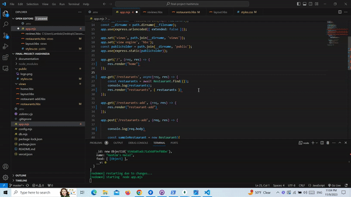
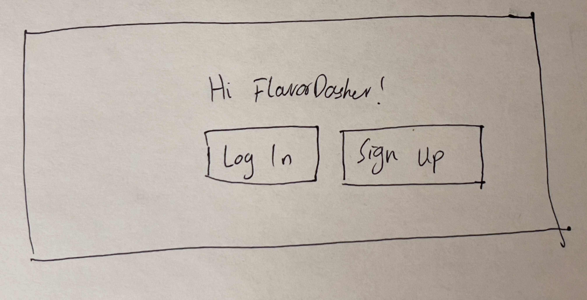
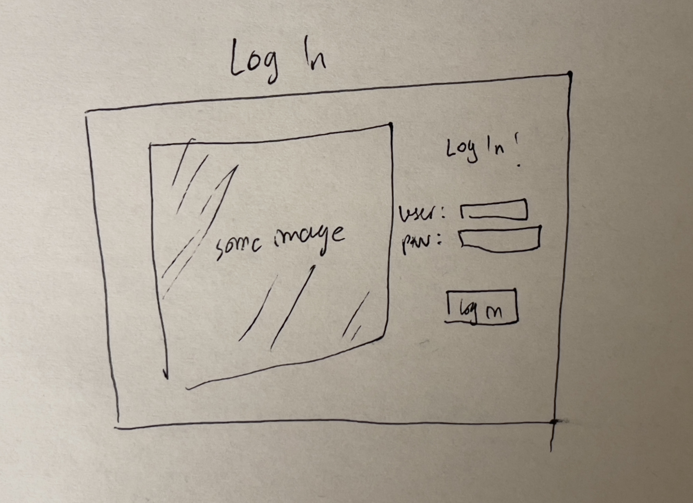
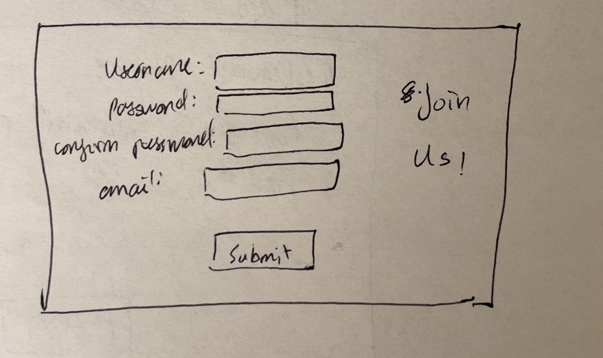
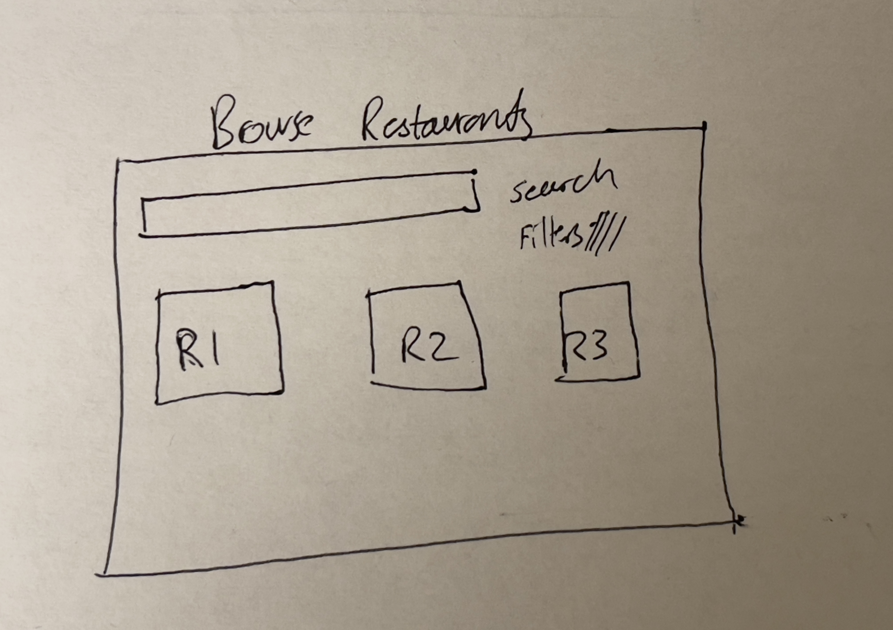
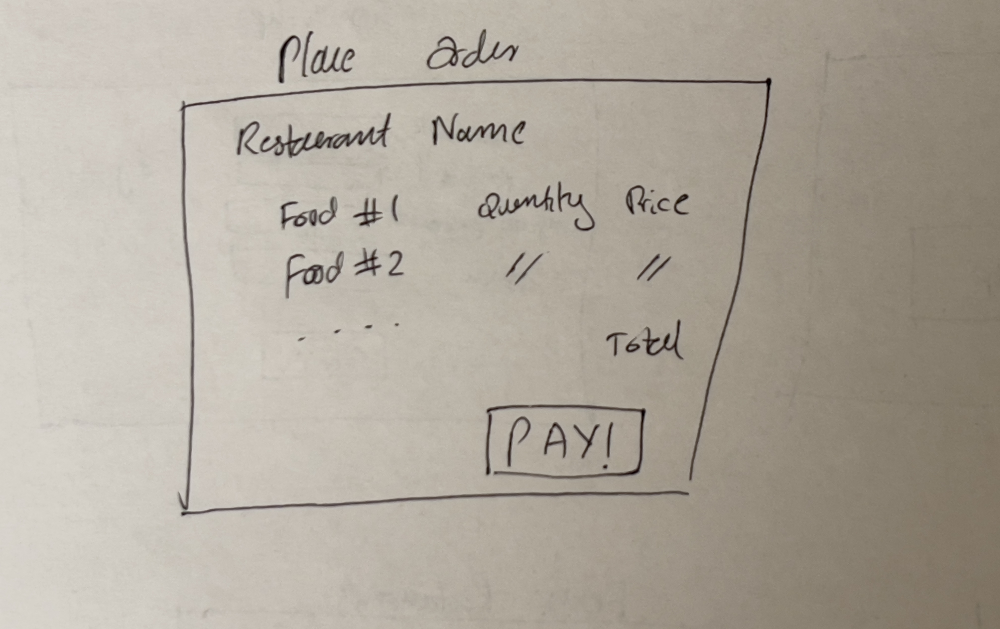
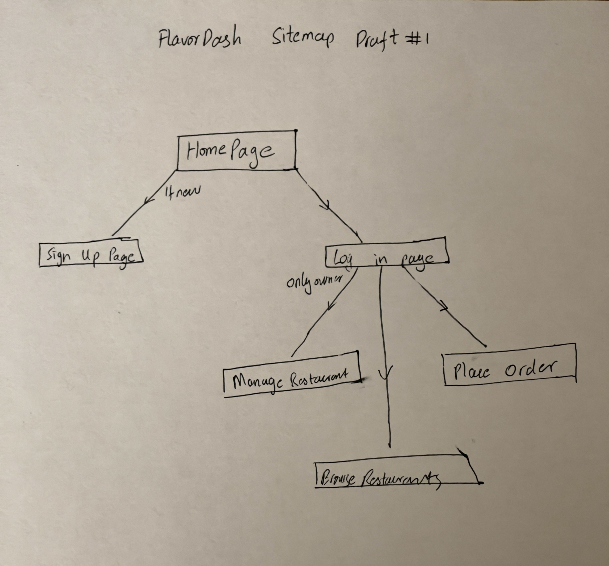

# FlavorDash

## Milestone 2 progress notes:

Reconsidering using react because I did not have enough time to implement it for this milestone

For now I have implemented ESLint as part of my workflow using VSCode autoformat on save. It shows errors for eslint configurations and fixes fixable errors on save. Currently the app has a form using handlebars however this might shift to react or nextjs if I can figure out deployment through them



## Overview

FlavorDash: Where Food Meets Convenience! Connect with nearby restaurants effortlessly, track your orders in real-time, and enjoy hassle-free menu management for restaurant owners.
With a focus on quality, convenience, and variety, FlavorDash is the ultimate destination for food lovers and local eateries, delivering delicious flavors right to your doorstep.
As a restaurant owner, streamline incoming orders and enhance your business on our user-friendly DASHboard.


## Data Model

The application will store Users, Restaurants and Food. Users can be create orders. A logged in user can also be the owner of a restaurant.
A restaurant can have a list of Food which will be used to create a menu. This can be managed by the owner of a restaurant.

* A user can be a costumer making an order or the owner of a restaurant which will grant them the privellege of managing their restaurant.
* A restaurant can have only one owner
* A restaurant can have a list of Food items


An Example User:

```javascript
{
  username: "betterthandoordash",
  hash: // a password hash,
  owner: //boolean, set true for restaurant owners
  restaurant: //if owner true, will reference Restaurant 
}
```

An Example Restaurant with Embedded Food Items:

```javascript
{
  name: "Halal Cart 202",
  food: [
    { name: "Chicken Over Rice", price: "9.99", ingredients: ["chicken","rice","salad"], description:"Best halal chicken over rice in the city"},
  ],
}
```


## [Link to Commented First Draft Schema](db.mjs) 


## Wireframes

/homepage - first page for any user



/login - old user login authentication page



/signup - new user signup



/restaurants - view restaurants for logged in users



/order - order food from a specific restaurant



## Site map



## User Stories or Use Cases

1. as non-registered user, I can register a new account with the site
2. as a user, I can log in to the site
3. as a user, I can browse through all the available restaurants
4. as a user, I can place an order
5. as an owner, I can manage my restaurant
6. as an owner, I can add/remove food

## Research Topics
Research topics are currently very tentative and most of these will probably change by the next milestone


* (4-6 points) React 
    * I'm going to research further on React to use it as a front-end library
    * Unsure about how much I would research further into it so the points are tentative between 4-6
*  (3 points) Configuration management
    *dotenv
*  (2 points) CSS Preprocessor
    * Sass
*  (2 points) Front-end Libraries
    * Will include many small utilitiy libraries:
        * Google Maps
        * Bootstrap
        * (maybe) P5js for animation
* (1 point) ESLint formatter integrated with vs code, formats on save;


## [Link to Initial Main Project File](app.mjs) 


(unchaged for now, will add references and resources as I use them for my project)
## Annotations / References Used

(__TODO__: list any tutorials/references/etc. that you've based your code off of)

1. [passport.js authentication docs](http://passportjs.org/docs) - (add link to source code that was based on this)
2. [tutorial on vue.js](https://vuejs.org/v2/guide/) - (add link to source code that was based on this)

